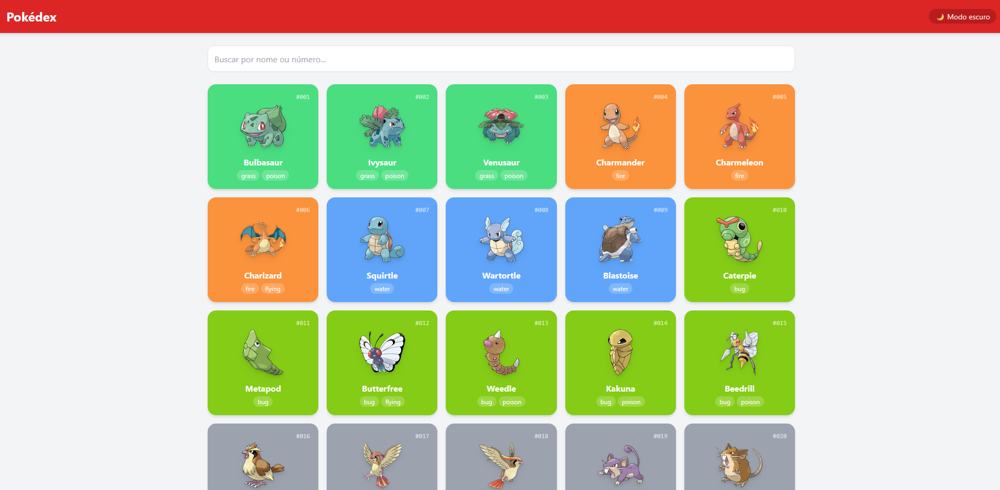
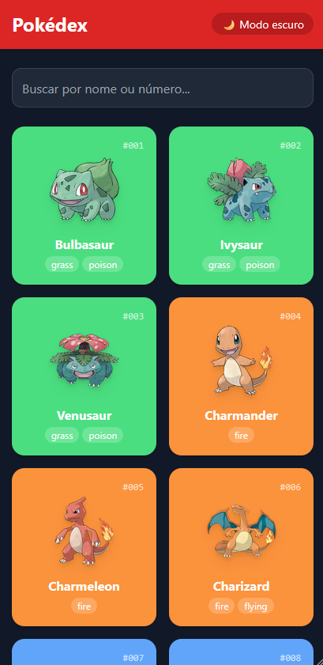

# Pokedex UI API 🧩


> Pokédex interativa que consome dados da API oficial de Pokémon, exibindo cards dinâmicos com busca em tempo real, carregamento progressivo e suporte a dark mode.

### ✨ [Veja o site ao vivo aqui!](https://anaflgg.github.io/pokedex-ui-api/)

---

### 📸 Screenshots

#### 💻 Desktop (Light Mode)


#### 📱 Mobile (Dark Mode)


---

### 📖 Sobre o Projeto
Projeto de Pokédex desenvolvido com JavaScript puro consumindo dados da PokeAPI. A aplicação exibe os Pokémon em formato de cards com cores dinâmicas baseadas no tipo, permitindo buscar por nome ou número, carregar mais resultados sob demanda e alternar entre tema claro e escuro (dark mode).

---

### 🔌 Integração com API
Os dados são consumidos da PokeAPI através de requisições HTTP. Inicialmente é feita uma chamada para listar os Pokémon com paginação, e em seguida são realizadas requisições adicionais para obter os detalhes individuais de cada Pokémon, como tipos, imagens e identificação.

---

### ⚙️ Como funciona
- A aplicação busca uma lista de Pokémon utilizando paginação (`limit` e `offset`)
- Para cada Pokémon, uma nova requisição é feita para obter seus detalhes completos
- Os dados são processados e renderizados dinamicamente no DOM
- Cada card armazena informações usando `dataset`
- A busca filtra em tempo real consultando uma lista completa de nomes pré-carregada, buscando os detalhes apenas dos Pokémon encontrados
- O usuário pode alternar entre tema claro e escuro (dark mode)

---

### 🚀 Tecnologias Utilizadas
- HTML5
- CSS3 (Tailwind CSS)
- JavaScript
- PokeAPI

---

### 🧠 Aprendizados
- Consumo de API com `fetch` e uso de `async/await`
- Manipulação e renderização dinâmica do DOM
- Uso de `Promise.all` para múltiplas requisições
- Implementação de busca em tempo real
- Uso de `dataset` para armazenar dados nos elementos HTML
- Estilização com Tailwind CSS
- Implementação de dark mode com manipulação de classes
- Controle de estado com paginação (offset)
- Gerenciamento de dois modos de estado distintos (paginação e busca global)

---

### 🐛 Desafios e Soluções
- A busca não retornava o Pokémon correto devido ao uso de índice incorreto. Resolvido utilizando `dataset` diretamente nos elementos HTML.
- Sincronização de múltiplas requisições da API. Resolvido com `Promise.all`.
- A busca em tempo real só funcionava para Pokémons já carregados na tela. Pesquisar por "Dragonite" sem tê-lo carregado não retornava nada. Resolvido 
pré-carregando a lista completa de nomes da PokeAPI (`limit=100000`) na 
inicialização e filtrando localmente, buscando os detalhes apenas dos resultados 
encontrados.

---

### 📝 Atualizações Futuras
Melhorias e novas funcionalidades serão adicionadas em breve conforme evolução do projeto.

---

### 👷 Como executar o projeto
Projeto estático, não precisa instalar nada.

1. Clone o repositório:
```bash
git clone https://github.com/anaflgg/pokedex-ui-api.git