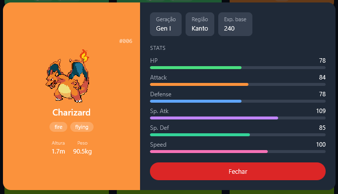

# Pokedex UI API 🧩


> Pokédex interativa que consome dados da API oficial de Pokémon, exibindo cards dinâmicos com busca em tempo real, infinite scroll e suporte a dark mode — com modal de detalhes ao clicar em cada Pokémon.

### ✨ [Veja o site ao vivo aqui!](https://anaflgg.github.io/pokedex-ui-api/)

---

### 📸 Screenshots

#### 💻 Desktop (Light Mode)


#### 📱 Mobile (Dark Mode)


---

### 📖 Sobre o Projeto
Projeto de Pokédex desenvolvido com JavaScript puro consumindo dados da PokeAPI. A aplicação exibe os Pokémon em formato de cards com cores dinâmicas baseadas no tipo, permite buscar por nome ou número em toda a base de dados, carrega novos Pokémon automaticamente com infinite scroll e exibe um modal de detalhes ao clicar em qualquer card — com stats, sprite animado, geração, região, altura e peso.

---

### 🔌 Integração com API
Os dados são consumidos da PokeAPI através de múltiplos endpoints:
- `pokemon?limit=&offset=` — lista paginada para o carregamento principal
- `pokemon/{id}` — detalhes individuais de cada Pokémon (tipos, sprites, stats)
- `pokemon?limit=100000` — lista completa de nomes para a busca global
- `pokemon-species/{id}` — dados de espécie (geração e região de origem)

---

### ⚙️ Como funciona
- A aplicação busca uma lista de Pokémon utilizando paginação (`limit` e `offset`)
- Para cada Pokémon, uma nova requisição é feita para obter seus detalhes completos
- Os dados são processados e renderizados dinamicamente no DOM
- Cada card armazena o ID do Pokémon usando `dataset` para identificação no clique
- Ao clicar num card, um modal é aberto com uma segunda chamada à API buscando dados da espécie (geração, região)
- O infinite scroll usa `IntersectionObserver` para detectar quando o usuário chega ao fim da página e carrega mais Pokémon automaticamente
- A busca filtra em tempo real consultando uma lista completa de nomes pré-carregada, buscando os detalhes apenas dos Pokémon encontrados
- O header é fixo e clicável — ao clicar em "Pokédex" a página rola suavemente ao topo
- O usuário pode alternar entre tema claro e escuro (dark mode)

---

### 🚀 Tecnologias Utilizadas
- HTML5
- CSS3 (Tailwind CSS)
- JavaScript
- PokeAPI

---

### 🧠 Aprendizados
- Consumo de API com `fetch` e uso de `async/await`
- Manipulação e renderização dinâmica do DOM
- Uso de `Promise.all` para múltiplas requisições paralelas
- Implementação de busca em tempo real com lista pré-carregada
- Uso de `dataset` para armazenar dados nos elementos HTML
- Estilização com Tailwind CSS via CDN
- Implementação de dark mode com manipulação de classes no `<html>`
- Controle de estado com paginação (`offset`) e flag `modoBusca`
- Infinite scroll com `IntersectionObserver`
- Modal dinâmico construído via `innerHTML` com dados de múltiplos endpoints
- Uso de `.find()` para buscar elementos em arrays
- Tratamento de erros com `try/catch` em chamadas de API
- Commits semânticos com mensagens em inglês
- Resolução de conflitos de merge no Git

---

### 🐛 Desafios e Soluções

#### v0.1 beta
- A busca não retornava o Pokémon correto devido ao uso de índice incorreto nos cards. Resolvido utilizando `dataset` diretamente nos elementos HTML para identificar cada card pelo ID do Pokémon.
- Sincronização de múltiplas requisições simultâneas da API causava inconsistências nos dados. Resolvido com `Promise.all`, garantindo que todos os detalhes fossem carregados antes de renderizar.
- A busca em tempo real só funcionava para Pokémon já carregados na tela — pesquisar por "Dragonite" sem tê-lo carregado não retornava nada. Resolvido pré-carregando a lista completa de nomes da PokeAPI (`limit=100000`) na inicialização e filtrando localmente, buscando os detalhes apenas dos resultados encontrados.

#### v1.0
- Cards duplicados aparecendo ao buscar Pokémon que já haviam sido carregados anteriormente. Resolvido verificando se já existe um elemento com aquele `data-id` no grid antes de criar um novo card.
- Modal travando infinitamente ao clicar em Mega evoluções e formas de Hisui. Esses Pokémon não possuem endpoint próprio em `pokemon-species`. Resolvido com `try/catch` na função `buscarEspecies`, exibindo `—` nos campos sem dados em vez de deixar o modal preso no "Carregando...".
- Região exibida incorretamente — Pokémon da Gen III, por exemplo, aparecia como Kanto. O encadeamento de `.replace()` causava matches parciais, pois a string `generation-i` estava contida em `generation-iii`. Resolvido substituindo toda a lógica por um objeto de mapeamento direto (`regioesPorGeracao`), onde cada chave retorna exatamente a geração e região corretas.
- Classes do Tailwind CSS não funcionavam dentro de template strings JavaScript. O Tailwind CDN só processa classes presentes no HTML estático — classes geradas dinamicamente via JS são ignoradas. Resolvido aplicando todos os estilos do modal via `style` inline com valores calculados em tempo de execução através da função `isDark()`.

---

### 📦 Histórico de Versões

---

#### 🔵 v1.0 — Modal de Detalhes, Infinite Scroll e Busca Global
> Maior atualização do projeto até agora. Foco em experiência do usuário, novas funcionalidades e correção de bugs estruturais.



**Novidades:**
- Modal de detalhes ao clicar em qualquer card, exibindo sprite animado, stats com barras de progresso coloridas por atributo, altura, peso, geração e região de origem
- Infinite scroll com `IntersectionObserver` — novos Pokémon carregam automaticamente conforme o usuário rola a página, substituindo o botão "Carregar mais"
- Busca global funcional em toda a base de dados da PokeAPI, não apenas nos Pokémon já carregados na tela
- Header fixo que acompanha o scroll da página
- Clique no título "Pokédex" rola suavemente ao topo da página
- Layout responsivo no modal: duas colunas no desktop, empilhado no mobile
- Dark mode funcionando corretamente dentro do modal (stats, badges e painéis)

**Correções:**
- Cards duplicados na busca
- Modal travando em Mega evoluções e formas regionais de Hisui
- Região exibida incorretamente para Pokémon de gerações múltiplas
- Classes Tailwind não aplicadas em elementos gerados dinamicamente via JS

---

#### 🟡 v0.1 beta — Estrutura Base
> Versão inicial do projeto. Foco em aprender consumo de API, renderização dinâmica e estilização com Tailwind.

**Novidades:**
- Estrutura HTML com Tailwind CSS via CDN
- Fetch da PokeAPI com `async/await` e `Promise.all`
- Grid responsivo de cards com cor de fundo baseada no tipo do Pokémon
- Busca em tempo real por nome ou número entre os Pokémon carregados
- Botão "Carregar mais" com paginação por `offset`
- Toggle de dark mode com persistência via classe no `<html>`

---

### 👷 Como executar o projeto
Projeto estático, não precisa instalar nada.

1. Clone o repositório:
```bash
git clone https://github.com/anaflgg/pokedex-ui-api.git
```
